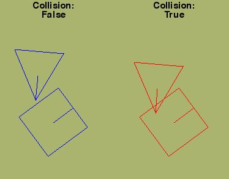

# 2D Collision detection with SAT
__Educational project.__
Python implementation of 2D collision detection algorithm based on Separating Axis Theorem (SAT).
Collision resolution algorithm is also proposed.
You can use `sat` to detect whether two shapes collide or `sat_resolve` to detect and resolve collisions.
## Requirements
Pygame is used for presentation in main.py and in `Shape` class in sat.py to draw the shape on a pygame surface.
Algorithms themselves are written in pure python.
## Presentation
Within `main` function in main.py you can choose if you want to see `sat` or `sat_resolve` in action.
Collisions are checked between a triangle and a suqare.
You can move both shapes - a triangle with arrow keys and a square with WSAD.

## Short explanation
This implementation mainly operates on lists of `Vectors`. `Vector` is a helper class representing a vector in 2D space. 
To check for collision you need two instances of class `Shape`. This class should contain a list of vertices (instances of class `Vector`), called `oryginal_vertices` which describe a shape within it's own, local coordinate system. Instace variable called `vertices` holds a copy of that list, which is translated to some `position` and rotated by some `angle`. In order to calculate transformed vertices `update` method should be called. Draw method also draws an additional line to show which direction shapes are *facing*.
